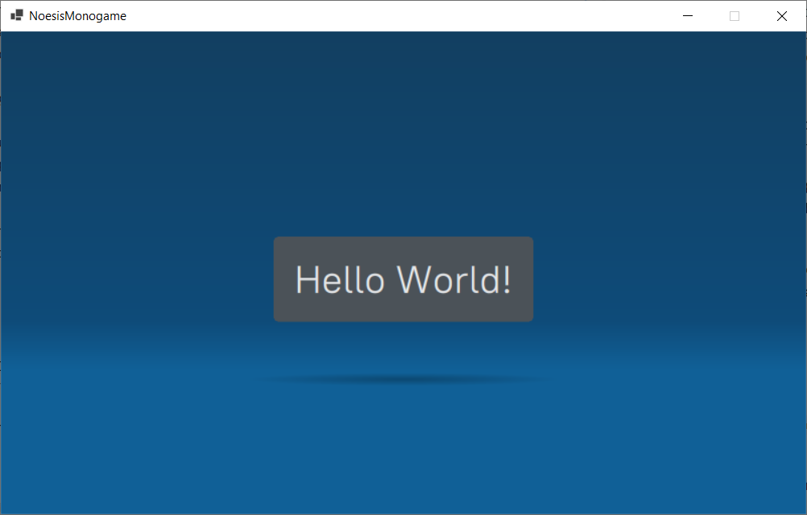

# Noesis GUI 3 Monogame Integration Example

## Introduction

This is an example integration of Noesis GUI 3 with MonoGame 3.8. It implements 
the integration from 
[the official C# DirectX integration example](https://github.com/Noesis/Tutorials/tree/master/Samples/IntegrationSharpDX)
for a blank MonoGame project. For this I used also some code from an 
[older integration example](https://github.com/AtomicTorchStudio/NoesisGUI.MonoGameWrapper)
which is provided from AtomicTorchStudio for Noesis GUI 2.

The credits for the re-used parts from the Noesis GUI 2 implementation still belong to 
AtomicTorchStudio. This is especially the case for the mouse-button handling and the 
save/restore code of the DirectX-device state. 

**Note:** The integration from AtomicTorchStudio contains also a branch, which a Noesis GUI 3 integration into
MonoGame 3.8 (see: https://github.com/AtomicTorchStudio/NoesisGUI.MonoGameWrapper/tree/3.0.12).

## Features

**This is not an productive version for a Noesis GUI integration**. It simply shows, that 
the Noesis GUI "Hello World" example from the original example can be executed by a
MonoGame application. This can be a starting point for a more productive integration as
the integration from AtomicTorchStudio was for Noesis GUI 3. 

In the more advanced version the following features are implemented:
* Loading XAML-, font- and texture-files from local disk (`<binary-directory>/Data/UI`)
* Hot reloading of XAML-files, if they have changed

The following things are missing:

* Window Resize is not detected and not passed through Noesis GUI
* Mouse double click detection has not been tested
* Mouse wheel event is passed through Noesis GUI regardless if the mouse is over a control element or not
* Keyboard events are not passed through Noesis GUI
* Hot reloading for Font and Textures is missing
* No event handling (from GUI to game) is implemented

Some of those features might be found in an more advanced branch or fork of this project.
The scope of this project is to deliver a simple as possible integration example for the
most recent versions of Noesis GUI (3.1.1) and MonoGame (3.8.0).

This code might not be up to date anymore, when you find it in 2 or 3 years. So feel free 
to fork this repository, update everything to the latest versions and create pull requests.

## Installation

Just clone the projects and open it with Rider or Visual Studio. Rename the file 
`NoesisLicense.cs.template` in the directory `source/NoesisMonogame/NoesisMonogame` to
`NoesisLicense.cs` (this file is ignored by a `.gitignore` entry) and add your license
details to this file. 

Compile everything and run the code and you should see the following:

Have a lot of fun!

